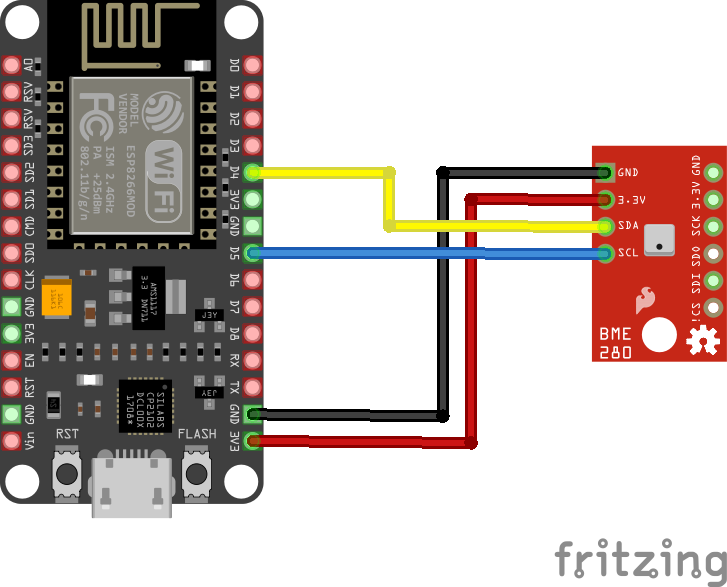

# Clima Sensor

## Intention

This project is intended to deploy a clima sensoring net in the Galicia Supercomputing Center CESGA. This starts with an ask to look for some reliable clima sensors to deploy and the now a days state is that we have our firts sensor integrated in the metrics database. As it have just happened the sensor is still in a testing face but we are whilling to add more sensors to the net iterating the process described below.

## Overview


The clima sensor project has 2 main separable parts. One is the from the perspective of the sensor, hardware, firmware and calibration. The other part is publushing sensor data into our database and being able to visualize it with our production tools. 

From the sensoring Device, hardware perspective, we have choosen a NodeMCU and a BME280. 
Our closest reference is this one from [Random Nerd Tutorials](https://randomnerdtutorials.com/esp8266-bme280-arduino-ide/).

We have modified the firmware porgram to export application/json to make it easier for us to integrate those readings with the database.

Also we have performed some calibration to the sensor and many tests are still ongoing.

For the publishing part we use a systemd timer that points to a python script that makes the publication. We are moving into this direction to try to unify the way we input data into our database. This timer is deployed in an administration virtual machine instanced with this purpose in mind, to unify there most of our metric exporters.

We have also design a enclosure and print it with our printer. this design it's also being refined but you can find some valid designs in [Enclosure](https://gitlab.com/cesga-sistemas/clima_sensor/-/tree/main/Enclosure).

## [Firmware](https://gitlab.com/cesga-sistemas/clima_sensor/-/blob/main/Firmware/Cesga-Prototype-Sensor-text-based.ino)

You need to include a specific Url to add esp8266 board to the Arduino Idle. Go to Files>Preferences and on the Additional boards urls section paste de next URL: http://arduino.esp8266.com/stable/package_esp8266com_index.json 

Once you have added this URL, you can search for the board in the board manager. Tools>boards>board manager.

Also, you need to include some libraries in the Ilde in order to work.

Libraries needed:

``` c++
#include <ESP8266WiFi.h>
#include <Wire.h>
#include <Adafruit_BME280.h>
#include <Adafruit_Sensor.h>
#include <ArduinoJson.h>
```

From here, modifying some parts of the firmware is quite straightforward. Add your wifi credentials, modify what the server prints and adjust calibration. Also, all these parts are well explained in the .io file.

## Calibration

For the calibration part, we have performed a by-comparison calibration for the temperature part and a salt method for the relative humidity sensing. We have not performed a pressure calibration as this is not an important aspect of our needs.

We have used a calibration-trusted thermometer to compare the measures with our sensor. As the differences were pretty stable we have done a change in the origin to adjust the values. For the Relative Humidity part, we have done a NaCl calibration for a measure of more than 12 hours and a range of 7 degrees celsius. We could have performed another salt point for the calibration but we have considered just one enough for our needs.

This process should be repeated for each sensor we introduce to the system. We could also simply do comparison calibration for both magnitudes but we also could parallelize it so would be better to repeat the process.

## [Publication](https://gitlab.com/cesga-sistemas/clima_sensor/-/blob/main/cesga-sensor_opentsdb/publish_cesga_sensor.py)

To read the values of the sensor we have implemented a systemd timer in a virtual machine that runs the publishing program every 5 minutes. We could easily increase granularity by modifing the timer but the sensor has some problems when your really speedups the readings to 6 readings per minute.

*Enlcaes al timer y explicación de donde esta alojado en la máquina*

## [Enclosure](https://gitlab.com/cesga-sistemas/clima_sensor/-/tree/main/Enclosure)

We have designed and print a simple enclosure just to protect the main body with some holes to do all the cabling.

*Enlaces a los archivos y algunas fotos*

## Cabling





**I2c vs SPI**

## Known issues

+ If the temperature increases to a certain value, the sensor starts wiping data and gets harder to send and read values. We could try to improve this by better isolating the core unit and placing it wisely. This temperature is about 49ºC for at least 3 hours for the sensor to start to fail.

+ If we ask the sensor to read more than one measure every 10 seconds, the publication becomes noisy. This is because the sensor starts to not respond well for every measure. 


