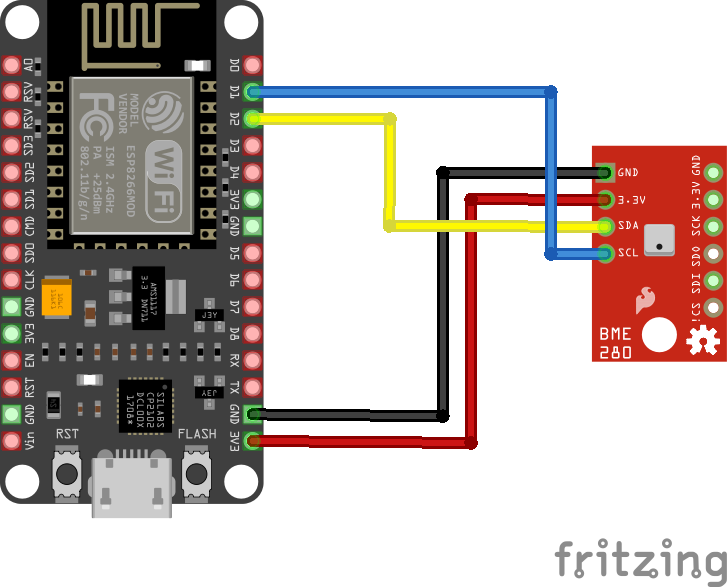

# Clima Sensor

## Intention

This project is intended to deploy a clima sensoring net in the Galicia Supercomputing Center CESGA.

We started by looking for some reliable clima sensors to deploy and now a days, the state of the project is that we have our firts sensor integrated within the metrics database. As it just have happened, the sensor is still in a testing face but we are whilling to add more sensors to the net iterating the process described below.


## Overview


The clima sensor project has 2 main separable parts. One is from device perspective, hardware, firmware and calibration while the other stands for publushing readings into our database and being able to visualize it with our production tools. 

From the hardware perspective, we have choosen a NodeMCU and a BME280. 
Our closest reference is this one from [Random Nerd Tutorials](https://randomnerdtutorials.com/esp8266-bme280-arduino-ide/).

We have modified firmware to export application/json data types to make it easier for us to integrate those readings with our database.

Also we have performed calibration to the sensor and many tests are still ongoing.

For the publishing part, we have used systemd timers wich points to a python script that makes the publication. We are moving into this direction to try to unify the way we input data into our database. This timer is deployed in an administration virtual machine instanced with this purpose in mind, to unify here most of our metric exporters in the future.

We have also design a enclosure and print it with our printer. this design is quite rude and it's also being refined. You can find some valid designs in [Enclosure](https://gitlab.com/cesga-sistemas/clima_sensor/-/tree/main/Enclosure).

## [Firmware](https://gitlab.com/cesga-sistemas/clima_sensor/-/blob/main/Firmware/Cesga-Prototype-Sensor-text-based.ino)

Starting from the firmware, you need to include a specific Url to add esp8266 board's to the Arduino's Idle. Go to Files>Preferences and on the "Additional boards" urls section paste de next URL: http://arduino.esp8266.com/stable/package_esp8266com_index.json 

Once you have added this URL, you can search for the board in the board manager. Tools>boards>board manager.

Also, you need to include some libraries in the Ilde in order to work.

Libraries needed:

``` c++
#include <ESP8266WiFi.h>
#include <Wire.h>
#include <Adafruit_BME280.h>
#include <Adafruit_Sensor.h>
#include <ArduinoJson.h>
```

From here, modifying some parts of the firmware is quite straightforward. Add your wifi credentials, modify what the server prints and adjust calibration. Also, all these parts are well explained in the ```.io``` file.

## Calibration

For the calibration part, we have performed a by-comparison calibration for the temperature and salt methods for relative humidity sensing. We have not performed a pressure calibration as this is not an important aspect of our needs.

We have used a calibration-trusted thermometer to compare the measures with our sensor. As the differences were pretty stable we have done a change in the origin to adjust the values. For the Relative Humidity part, we have done a *NaCl* calibration performing a measure for more than 12 hours and a range of 7 degrees celsius. We could have performed another salt point for the calibration but we have considered that just one is enough for our needs.

This process should be repeated for each sensor we introduce to the system. We could also simply do comparison calibration for both magnitudes but we also could parallelize it so would be better to repeat the process.

## [Publication](https://gitlab.com/cesga-sistemas/clima_sensor/-/blob/main/cesga-sensor_opentsdb/publish_cesga_sensor.py)

To read the values of the sensor we have implemented a systemd timer in a virtual machine that runs the publishing program every 5 minutes. We could easily increase granularity by modifing the timer but the sensor has some problems when your really speedups the readings to the order of +6 readings per minute.


## [Enclosure](https://gitlab.com/cesga-sistemas/clima_sensor/-/tree/main/Enclosure)

We have designed and print a simple enclosure just to protect the main body with some holes to do all the cabling. We have added a cover to close the device.

## Cabling




**I2c vs SPI**: If you prefer to conect the BME with SPI instead of I2 you should buy a BME unit with 6 pins instead of 4. The main advantage of connecting the sensor in this way is that you can easily add another sensing unit to the node and ask for their data separatelly defining 2 diferent addreses. The addres is asigned acordingly to the cabling and this solution should be the main way of building 2 ends-sensors.

## Known issues

+ If the temperature increases to a certain value, the sensor starts wiping data and gets harder to send and read values. We could try to improve this by better isolating the core unit and placing it wisely. This temperature is about 49ºC for at least 3 hours for the sensor to start to fail.

+ If we ask the sensor to read more than one measure every 10 seconds, the publication becomes noisy. This is because the sensor starts to not respond well for every measure. 


